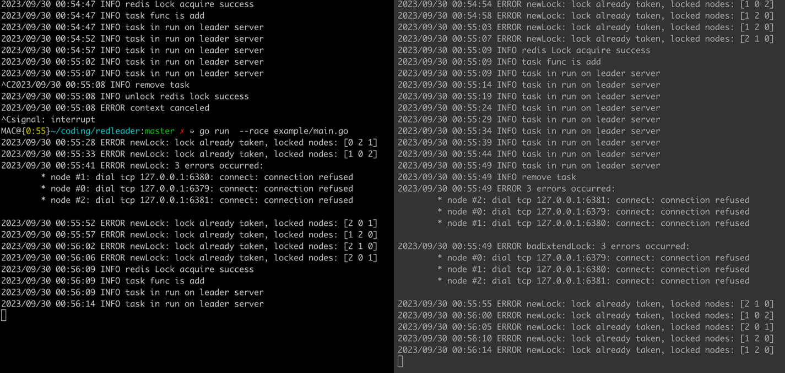

# redleader
an implementation of leader election using Redis as the coordination mechanism:

* Redis
* Leadership election.

# example
setup redis servers
``bash 
git clone github.com/dtest11/redleader
cd redleader
make setup
go run example/main.go
``
you can check example/main.go

